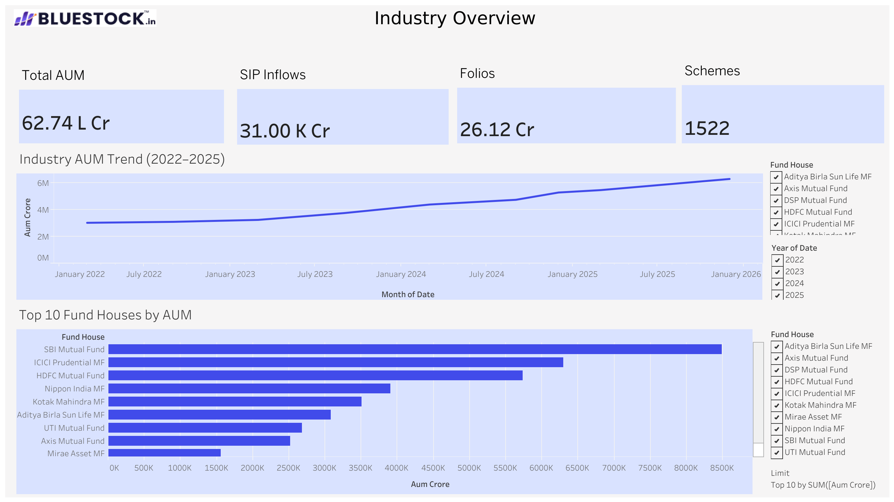
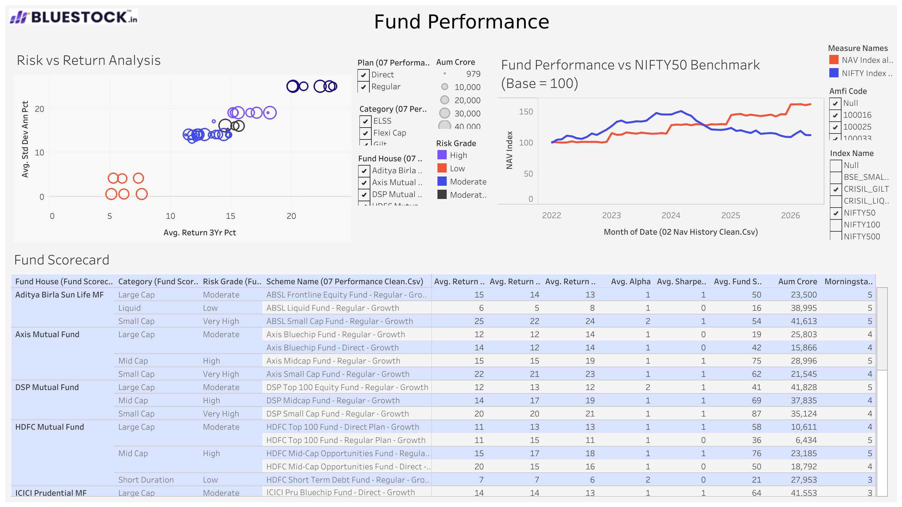
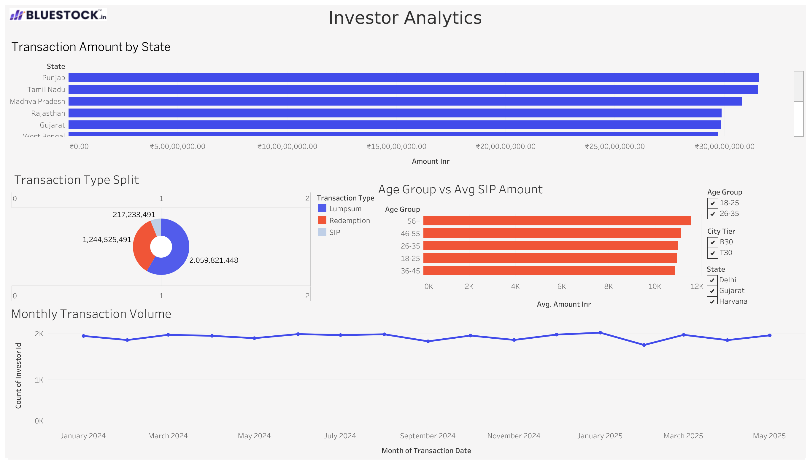
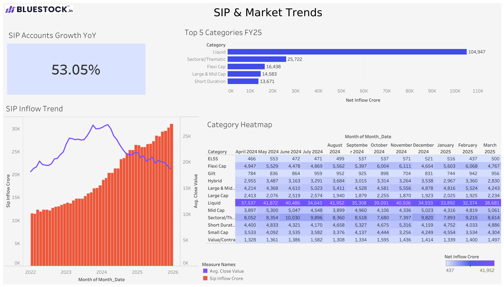

# Bluestock Mutual Fund Analytics Capstone

## Project Overview

The Bluestock Mutual Fund Analytics Capstone is an end-to-end financial analytics project developed to analyse the Indian mutual fund industry using data engineering, exploratory data analysis, performance analytics, and business intelligence techniques.

The project integrates multiple mutual fund datasets covering fund characteristics, NAV history, Assets Under Management (AUM), SIP inflows, investor transactions, benchmark indices, portfolio holdings, and scheme performance. A structured ETL pipeline was developed to transform raw financial data into analytical datasets that support reporting, dashboard development, and investment analysis.

The final solution combines Python-based analytics, SQLite database management, and Tableau dashboards to generate actionable insights related to industry growth, investor behaviour, portfolio allocation, and risk-adjusted fund performance.

---

## Project Objectives

* Build an end-to-end mutual fund analytics pipeline.
* Perform data ingestion, cleaning, validation, and transformation.
* Develop a structured analytical data repository.
* Conduct exploratory data analysis on industry and investor trends.
* Evaluate fund performance using risk-adjusted metrics.
* Create interactive Tableau dashboards.
* Generate business insights and recommendations for stakeholders.

---

## Technology Stack

### Programming & Analytics

* Python
* Pandas
* NumPy
* Matplotlib
* Seaborn
* Jupyter Notebook

### Database

* SQLite

### Visualisation

* Tableau

### Documentation

* LaTeX
* Markdown

### Version Control

* Git
* GitHub

---

## Project Architecture

```text
Raw Datasets
      ↓
Data Ingestion
      ↓
ETL Pipeline
      ↓
Processed Datasets
      ↓
SQLite Repository
      ↓
EDA & Analytics
      ↓
Performance Analytics
      ↓
Tableau Dashboards
      ↓
Business Insights
```

---

## Project Structure

```text
bluestock_mf_capstone/

├── dashboard/
├── sql/
├── data/
│   ├── raw/
│   ├── processed/
│   └── db/
├── notebooks/
├── reports/
├── scripts/
├── run_pipeline.py
└── requirements.txt
```
Note: The repository includes source code, notebooks, processed datasets, dashboard assets, project reports, and presentation materials required to reproduce the complete analytics workflow.

---

## Datasets Used

The project uses ten major datasets:

| Dataset               | Purpose                              |
| --------------------- | ------------------------------------ |
| Fund Master           | Scheme metadata and classifications  |
| NAV History           | Daily NAV records and trend analysis |
| AUM by Fund House     | Industry growth analysis             |
| SIP Inflows           | Retail investor participation trends |
| Category Inflows      | Category-wise investment behaviour   |
| Industry Folio Count  | Investor growth analysis             |
| Scheme Performance    | Return and risk analytics            |
| Investor Transactions | Demographic and behavioural analysis |
| Portfolio Holdings    | Sector allocation analysis           |
| Benchmark Indices     | Market comparison and benchmarking   |

Total analytical records processed across datasets: **87,000+**

---

## ETL Workflow

The ETL pipeline consists of the following stages:

### 1. Data Ingestion

* Load raw CSV datasets.
* Validate schema consistency.
* Perform initial profiling.

### 2. Data Cleaning

* Handle missing values.
* Standardise formats.
* Validate key identifiers.

### 3. Data Transformation

* Generate analytical datasets.
* Compute derived metrics.
* Create performance tables.

### 4. Database Loading

* Load processed datasets into SQLite.
* Execute validation queries.
* Support dashboard integration.

---

## Exploratory Data Analysis

Key analytical areas include:

* NAV trend analysis
* AUM growth analysis
* SIP inflow trends
* Category inflow analysis
* Investor demographic analysis
* Geographic participation analysis
* Sector allocation analysis
* Portfolio diversification analysis

Generated visualisations are available in:

```text
reports/charts/
```

---

## Performance Analytics

The project evaluates mutual fund performance using:

* CAGR (Compound Annual Growth Rate)
* Sharpe Ratio
* Sortino Ratio
* Alpha
* Beta
* Tracking Error
* Maximum Drawdown

Advanced analytics include:

* Rolling Sharpe Ratio Analysis
* Sector Concentration Analysis (HHI)
* Portfolio Diversification Evaluation

---

## Dashboard Overview

The Tableau dashboard provides four major analytical views:

### Industry Overview Dashboard

* AUM growth tracking
* SIP inflow trends
* Industry KPIs
* Folio growth analysis

### Fund Performance Dashboard

* Return comparison
* Risk metrics
* Benchmark analysis

### Investor Analytics Dashboard

* Investor demographics
* SIP participation patterns
* Geographic distribution

### Market Trends Dashboard

* Category inflows
* Sector allocation
* Market trends

Dashboard file:

```text

dashboard/bluestock_mf_dashboard.twbx

```
## Dashboard Screenshots

### Industry Overview Dashboard



### Fund Performance Dashboard



### Investor Analytics Dashboard



### Market Trends Dashboard


---

## Installation

Clone the repository:

```bash
git clone <repository-url>
cd bluestock_mf_capstone
```

Install dependencies:

```bash
pip install -r requirements.txt
```

---

## Running the Project

### Execute Complete Pipeline

```bash
python run_pipeline.py
```

### Execute Individual Scripts

```bash
python scripts/data_ingestion.py

python scripts/load_to_sqlite.py

python scripts/load_star_schema.py
```

---

## Opening the Dashboard

Open the Tableau dashboard:

```text
dashboard/bluestock_mf_dashboard.twbx
```

Requirements:

* Tableau Desktop
  or
* Tableau Public

---

## Reports and Documentation

Available documentation includes:

```text
reports/data_dictionary.md
reports/data_quality_report.txt
reports/data_ingestion_output.txt
```

Final deliverables:

* Final Report (PDF)
* Tableau Dashboard
* Presentation Deck
* Analytical Reports

---

## Key Findings

* SIP participation continues to grow steadily.
* Investor folio counts indicate increasing market participation.
* Major AMCs maintain significant market share.
* Sector diversification reduces portfolio concentration risk.
* Risk-adjusted metrics provide deeper insights than return-based evaluation alone.

---
## Project Outcomes

- Developed a complete end-to-end mutual fund analytics pipeline.
- Processed and analysed 87,000+ financial records.
- Built an SQLite analytical repository for efficient querying.
- Generated risk-adjusted performance metrics for mutual fund evaluation.
- Designed interactive Tableau dashboards for business intelligence reporting.
- Produced actionable insights related to investor behaviour, industry growth, and fund performance.

---

## Future Enhancements

* Real-time NAV integration.
* Mutual fund recommendation engine.
* Predictive analytics models.
* Portfolio optimisation framework.
* Advanced risk forecasting.
* Automated dashboard refresh.

---

## Author

**Shreya Sinha**

B.Tech Information Technology
Vellore Institute of Technology, Vellore

Bluestock Mutual Fund Analytics Capstone
Project Manager: Yash Kale

June 2026
